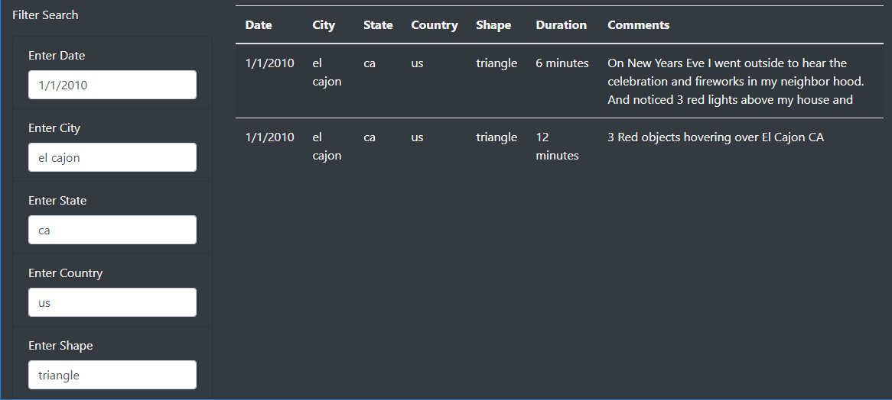

# UFOs
In this module, we have been utilizing JavaScript and HTML to build web applications. We incorporated [D3.js](https://d3js.org/) to load data into the HTML and respond to input changes. We also included [Bootstrap](https://getbootstrap.com/) to improve the look of our application and to make it responsive. We have been working on a web site that allows users to search for instances of UFO sightings.

## Overview
For this week's challenge, we were tasked to improve upon the searching capabilities of the application. In addition to the existing date input control, we added four additional input controls that allow users to filter the data further. Specifically, we added the ability to also filter by city, state, country, and shape. We performed this work by primarily editing the [index.html](index.html) and [app.js](static/js/app.js) files.

## Results
The application is hosted via GitHub pages and can be accessed here: [UFOs](https://haldud.github.io/ufos/)

The user interface is fairly straightforward. All UFO sightings are initially displayed in a table upon page load. From there, the user may search for sightings on multiple criteria. Simply enter any value in the search criteria fields. Once you tab out of the field or press Enter, the table will be refreshed and only UFO sightings matching all of the provided criteria will display.

Here is an example where search criteria for all fields is provided and the results filtered accordingly:

## Summary
One major drawback that I see of this web page is the dependency on a static JSON file containing the UFO sightings. While UFO sightings may not be common, one would assume that we would want to make the list of UFO sightings more easily editable and/or database based. It may be best to have the web site retrieve UFO sightings from a database.

Here are two additional recommendations to make the website more friendly to use:
1. It would be nice to have the text fields recommend data with auto complete options, and perhaps limit me to those options if we are going to be performing exact matches on the provided text. For example, don't let me type the name of a city only to find out there are no UFO sightings. This can be done on all controls. Once one filter is applied, then the recommendations would change accordingly for every other input that's currently empty.
2. A user would also have a better experience if the table columns were sortable. For example, one could easily identify the most recent or oldest UFO sighting by simply clicking on the Date header column.

While the web site is quite limiting in functionality, we were able to demonstrate how quickly we can provide a rich user experience with a limited amount of code and effort. The primary reason for this is that we are using proven languages and frameworks in the web application development space.
